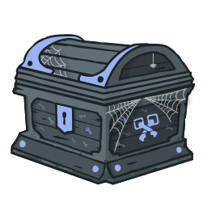

<h2 align="center">Baú</h2>

<h4 align="center"><strong>Bash All Urls</strong></h4>

<p align="center">
  <a href="#instalation-">Instalation</a> •
  <a href="#examples-">Examples</a>
</p>

<p align="center">
  
</p>

<hr>

## Instalation <br>

> Required:
> [curl](https://curl.se/docs/install.html)

```bash
git clone https://github.com/RodricBr/bau
cd bau/;chmod +x bau
sudo mv bau /usr/local/bin/
bau
```

## Examples <br>

```bash
# Normal use
bau vulnweb.com -ns "js|svg|png"
bau vulnweb.com -s "js|php|svg|png|jpeg|jpg"
bau vulnweb.com -ns
bau vulnweb.com -s
```

> [Nilo](https://github.com/ferreiraklet/nilo) - Checks if URL has status 200

> [AiriXSS](https://github.com/ferreiraklet/airixss) - Checks for reflected parameters

> [HTTPx](https://github.com/projectdiscovery/httpx) - URL probbing 

```bash
# Pratical use with XARGS
echo "vulnweb.com" | xargs -I{} bash -c 'bau {} -ns' | nilo

# XSS Hunting w/ NILO (Faster)
echo "vulnweb.com" | xargs -I{} bash -c 'bau {} -s "php|js|svg|png"' | nilo | qsreplace '"><svg onload=alert(1)>' | airixss -payload "alert(1)"

# XSS Hunting w/ HTTPx (Probbing & slower)
echo "vulnweb.com" | xargs -I{} bash -c 'bau {} -s "php|js|svg|png"' | httpx -silent -mc 200 | qsreplace '"><svg onload=alert(1)>' | airixss -payload "alert(1)"
```

