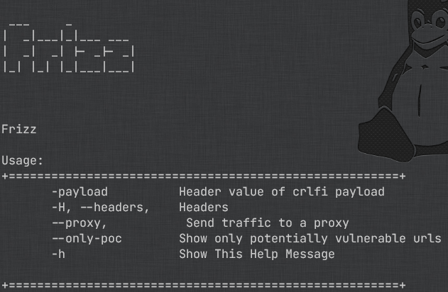

<h1 align="center">Frizz</h2>

<h4 align="center"><strong>CRLF Injection Finder</strong></h4>

<p align="center">
  <a href="#instalation-">Instalation</a> •
  <a href="#examples-">Examples</a>
</p>

<p align="center">
  
</p>

<hr>

## Instalation <br>

```bash
git clone https://github.com/ferreiraklet/frizz
cd frizz/
go build .
sudo mv frizz /usr/local/bin/
frizz -h
```

## Examples <br>

```bash
# Normal use
bau vulnweb.com -ns "js|svg|png"
bau vulnweb.com -s "js|php|svg|png|jpeg|jpg"
bau vulnweb.com -ns
bau vulnweb.com -s
```

```bash
# Pratical use with XARGS
echo "vulnweb.com" | xargs -I{} bash -c 'bau {} -ns' | nilo

# XSS Hunting w/ NILO (Faster)
echo "vulnweb.com" | xargs -I{} bash -c 'bau {} -s "php|js|svg|png"' | nilo | uro | qsreplace '"><svg onload=alert(1)>' | airixss -payload "alert(1)"

# XSS Hunting w/ HTTPx (Probbing & slower)
echo "vulnweb.com" | xargs -I{} bash -c 'bau {} -s "php|js|svg|png"' | httpx -silent -mc 200 | qsreplace '"><svg onload=alert(1)>' | airixss -payload "alert(1)"
```

<br>

## Check out some of my other programs <br>

> [Nilo](https://github.com/ferreiraklet/nilo) - Checks if URL has status 200

> [AiriXSS](https://github.com/ferreiraklet/airixss) - Checks for reflected parameters

> [Jeeves](https://github.com/ferreiraklet/jeeves) - SQL Injection Finder
